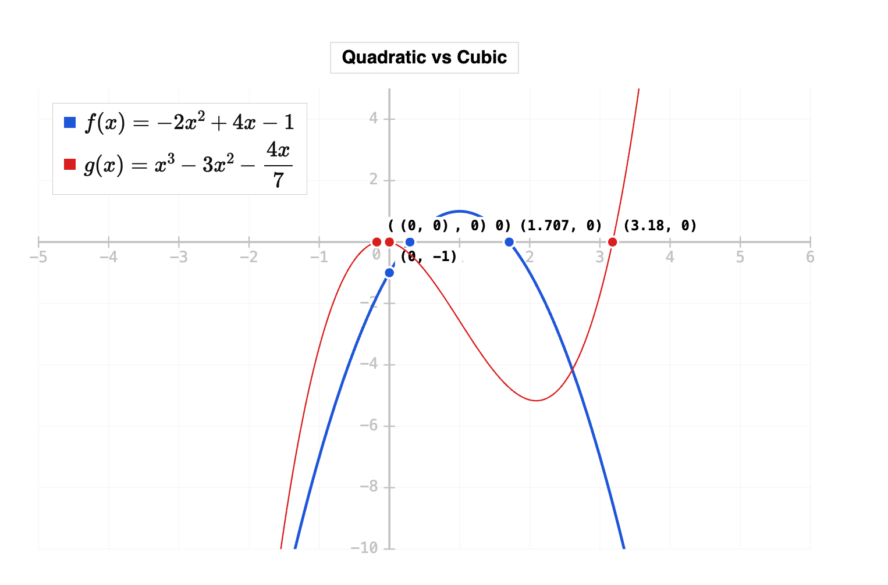

# Grapher

An Obsidian plugin that renders mathematical equations as graphs directly in your notes using a `grapher` code block.

**Repository:** https://github.com/jsglazer/grapher-dev

---




## Usage

Create a fenced code block with the language set to `grapher`:

````
```grapher
eq: f(x) = x^3 - 3x^2 - 4x
axis: #c2c2c2
lines: #1e56d9
linewidth: 2px
render: 60%
```
````

---

## Parameters

### Global options

| Parameter | Description | Example |
|-----------|-------------|---------|
| `title:` | Graph title displayed at the top in a white box | `title: My Graph` |
| `axis:` | Color of axes, tick marks, and grid | `axis: #c2c2c2` |
| `render:` | Width of the rendered graph (px or %) | `render: 50%` or `render: 400px` |
| `scalex:` | X-axis range. Two values = `min,max`. Single value = symmetric `±n`. Omit for auto. | `scalex: -10,10` or `scalex: 5` |
| `scaley:` | Y-axis range. Same format as `scalex`. | `scaley: -2,2` or `scaley: 3` |
| `EqLoc:` | Position of equation label on the graph. Options: `left`, `right`, `above`, `below`. Omit to hide. | `EqLoc: left` |
| `params:` | Named constants available to all equations, comma-separated `name=value` pairs. | `params: n=3, a=2` |

### Constants (params)

Use `params:` to define named constant values that can be referenced in any equation. This is useful for equations with variable exponents, scaling factors, or any expression that depends on a value you want to change without rewriting the equation.

```
eq: f(x) = x^{1/n}
params: n=3
```

Multiple constants are comma-separated:

```
eq: f(x) = a * x^{1/n}
params: n=3, a=2
```

Params apply to **all** equations in the block, so you can share a constant across curves:

````
```grapher
eq1: f(x) = x^{1/n}
eq2: g(x) = x^{2/n}
params: n=3
axis: #c2c2c2
EqLoc: right
```
````

When `EqLoc:` is set, param values are shown in the equation label below the curve list.

> **Note:** Only `x` is the free variable. Every other letter in an equation must be given a value via `params:`, otherwise the curve will not render.

---

### Per-equation options

**Single equation** — use `eq:` with options at the global level:

```
eq: f(x) = x^2
lines: #1e56d9
linewidth: 2px
intx: true
```

**Multiple equations** — use `eq1:`, `eq2:`, etc. with per-equation sub-options prefixed by ` - `. `eq:` is not valid when graphing multiple equations.

```
eq1: f(x) = x^2
 - lines: #1e56d9
 - linewidth: 2px
 - intx: true
eq2: g(x) = x + 1
 - lines: #d91e1e
 - linewidth: 1px
```

| Parameter | Description | Example |
|-----------|-------------|---------|
| `eq:` | Equation key for a **single** equation only. | `eq: f(x) = sin(x)` |
| `eq1:` / `eq2:` / `eq3:` ... | Equation keys for **multiple** equations. | `eq1: f(x) = x^2` |
| `lines:` | Curve color (hex) | `lines: #1e56d9` |
| `linewidth:` | Stroke width in px | `linewidth: 2px` |
| `intx:` | Plot x-intercepts with coordinate labels | `intx: true` |
| `inty:` | Plot y-intercept with coordinate label | `inty: true` |

---

## Supported expressions

Grapher uses [math.js](https://mathjs.org) for evaluation. Supported syntax includes:

- Polynomials: `x^3 - 3x^2 + 2x - 1`
- Trig functions: `sin(x)`, `cos(x)`, `tan(x)`, `asin(x)`, `acos(x)`, `atan(x)`
- Exponentials and logs: `e^x`, `exp(x)`, `log(x)`, `log(x, 10)`
- Square roots and powers: `sqrt(x)`, `x^(1/3)`
- Constants: `pi`, `e`
- Implicit multiplication: `3x`, `2sin(x)`

### LaTeX input

LaTeX notation is also accepted and converted automatically. Common patterns:

| LaTeX | math.js equivalent |
|-------|--------------------|
| `\frac{a}{b}` | `(a)/(b)` |
| `\sqrt{x}` | `sqrt(x)` |
| `\sqrt[n]{x}` | `x^(1/n)` |
| `x^{n+1}` | `x^(n+1)` |
| `\sin`, `\cos`, `\ln`, etc. | `sin`, `cos`, `ln`, etc. |
| `\pi` | `pi` |
| `\left(\ldots\right)` | `(...)` |
| `\left\|x\right\|` | `abs(x)` |
| `\cdot`, `\times` | `*` |

Example: `eq: f(x) = 2 + \frac{1}{x}` is valid.

### Piecewise-defined functions

Use `\begin{cases}...\end{cases}` LaTeX notation. Each row is `expression & condition`, rows separated by `\\`. The last row's condition is optional (it acts as the default/else branch).

````
```grapher
eq: f(x) = \begin{cases} x+3 & x < 1 \\ (x-2)^2 & x \ge 1 \end{cases}
```
````

Open circles ○ are drawn at strict-inequality boundaries (`<`, `>`); closed circles ● at inclusive boundaries (`\le`, `\ge`, `\leq`, `\geq`).

More than two pieces are supported:

````
```grapher
eq: f(x) = \begin{cases} -x & x < -1 \\ x^2 & -1 \le x < 2 \\ 4 & x \ge 2 \end{cases}
scalex: -5,5
scaley: -2,6
```
````

Each piece can use any expression valid in a regular `eq:` field, including LaTeX like `\frac`, `\sqrt`, trig functions, and `params:` constants.

---

## Sample — multiple equations

````
```grapher
title: Quadratic vs Cubic
eq1: f(x) = -2x^2 + 4x - 1
 - lines: #1e56d9
 - linewidth: 2px
 - intx: true
 - inty: true
eq2: g(x) = x^3 - 3x^2 - 4x
 - lines: #d91e1e
 - linewidth: 1px
 - intx: true
axis: #c2c2c2
render: 75%
EqLoc: above
scalex: -5,6
scaley: 5
```
````
